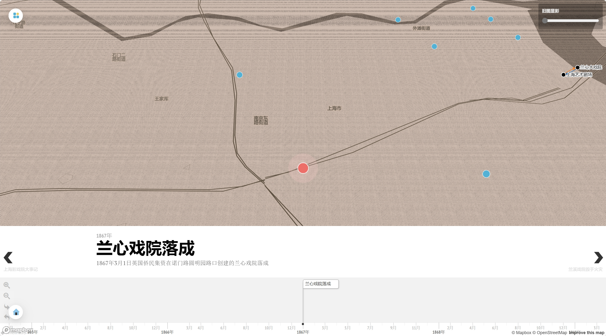
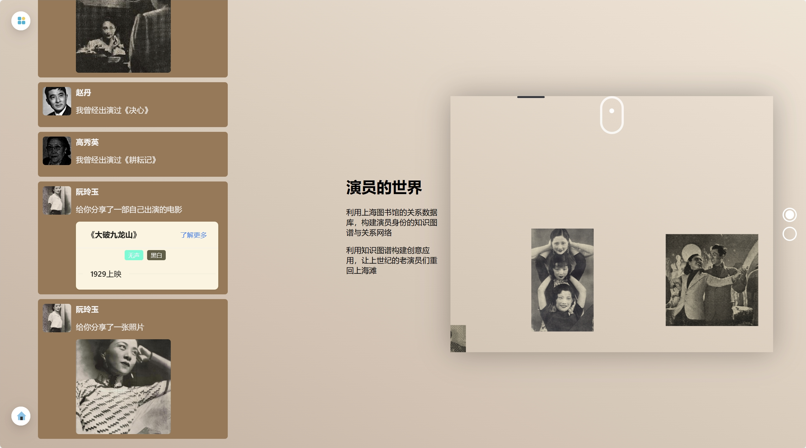
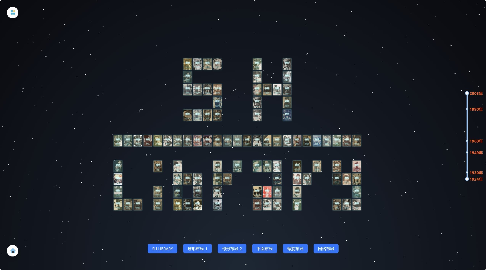

<a name="readme-top"></a>

[![Contributors][contributors-shield]][contributors-url]
[![Stargazers][stars-shield]][stars-url]
[![Issues][issues-shield]][issues-url]
[![MIT License][license-shield]][license-url]


<!-- PROJECT LOGO -->
<br />
<div align="center">

  <a href="https://github.com/ChenZiHong-Gavin/chinese-old-movie">
    
  </a>

<h3 align="center">一千零一夜</h3>
<h3 align="center">TALES FROM THE THOUSAND AND ONE NIGHTS</h3>

  <p align="center">
    A creative platfrom for movies.
    <br />
    <br />
    <a href="https://chinese-old-movie.vercel.app/">View Website</a>
    ·
    <a href="https://github.com/ChenZiHong-Gavin/chinese-old-movie/issues">Report Bug</a>
    ·
    <a href="https://github.com/ChenZiHong-Gavin/chinese-old-movie/issues">Request Feature</a>
  </p>
  <a href="https://github.com/ChenZiHong-Gavin/chinese-old-movie">
    
  </a>
</div>


<!-- TABLE OF CONTENTS -->
<details>
  <summary>Table of Contents</summary>
  <ol>
    <li>
      <a href="#about-the-project">About The Project</a>
      <ul>
        <li><a href="#built-with">Built With</a></li>
        <li><a href="#pages">Pages</a></li>
      </ul>
    </li>
    <li>
      <a href="#getting-started">Getting Started</a>
    </li>
    <li><a href="#creativity">Creativity</a></li>
    <li><a href="#roadmap">Roadmap</a></li>
    <li><a href="#contributing">Contributing</a></li>
    <li><a href="#license">License</a></li>
    <li><a href="#contact">Contact</a></li>
    <li><a href="#acknowledgments">Acknowledgments</a>
          <ul>
        <li><a href="#awards">Awards</a></li>
        <li><a href="#references">References</a></li>
      </ul>
    </li>
  </ol>
</details>


<!-- ABOUT THE PROJECT -->
## About The Project


一千零一夜——用<strong>AI和创意</strong>“活化”老电影数据，一款以<strong>时空关系</strong>为表达特性向用户呈现电影知识的产品。

- 利用大数据分析、可视化和人工智能等最先进的技术，将上海图书馆提供的老电影数据打散、重组、聚类、统计、生成，分析电影片段中的台词、画面、演员等等，为电影研究者提供新的视野，为内容创作者提供新鲜灵感，为电影爱好者提供更深入的欣赏体验。

- 在宏观的电影信息洪流中明察秋毫，为反思中国电影实践、推动中国电影学术创新、公众知识普及等搭建了一个中国电影数字平台。


Shanghai Library provides a rich repository of high-quality cultural data, allowing me to leverage my skills in data analysis and visualization to nurture creativity and explore new horizons in the field of "AI Empowering the Humanities." Throughout the development process, I've had the chance to learn and apply my knowledge, creating new chapters using the extensive movie data available, thus continuing to shine brightly in the present day.


### Built With

* [![React][React.js]][React-url]
* [![SpringBoot][SpringBoot]][SpringBoot-url]
* [![MongoDB][MongoDB]][MongoDB-url]


### Pages

1. 戏院落成：上海影戏院兴衰史

    TheatreTale: The Rise and Fall of Theaters in Shanghai

    

 
2. 共度喜忧：老电影的情绪挖掘、感知与匹配

    MoodFlix: Emotional Mining, Perception, and Matching of Classic Movies

    

3. 卧虎藏龙：基于电影网络分析的影人年谱

    MovieCast: Chronology Based on Network Analysis

    

4. 时光筛影：剧照时代性分析

    CineSnap: Analysis of Still Images in Relation to Historical Context

    

### Dataset

- 老电影知识库
    - **电影元数据4129部**
    - 影人5500人
        - 4012位演员
        - 915位导演
        - 272位编剧
    - **影戏院9家**
    - **电影期刊400种**
        - **篇目84099篇**
    - 电影音频44段
    - **电影视频154段**
    - **电影老照片1740张**
        - 588张电影剧照
        - 1154张书影照片

<!-- GETTING STARTED -->
## Getting Started

1. Clone the repo
   ```sh
   git clone https://github.com/ChenZiHong-Gavin/chinese-old-movie.git
   ```
2. Start the front-end and back-end projects separately

    Front-end:

    ```sh
    npm install
    npm start
    ```

     Back-end:
    ```sh
     mvn clean install
    ```


## Creativity

地理信息系统与历史重建，提供了戏院数据的地理可视化展示

Geographic Information Systems and Historical Reconstruction which facilitated the geographical visualization display of theater data

情感分析与音视频处理：深入挖掘电影情感元素，进行修复、上色等

Sentiment Analysis and Audio-Visual Processing involve in-depth exploration of emotional elements in films, encompassing restoration and colorization

知识图谱与创新互动：借助知识图谱让用户与老演员进行虚拟互动

Knowledge Graphs and Innovative Interaction utilize knowledge graphs to enable virtual interactions between users and veteran actors

AI实验室的探索：尝试了图片风格迁移等

The Exploration of the AI Lab such as image style transfer

规模化数据分析与综合性数字人文研究

Large-Scale Data Analysis and Comprehensive Digital Humanities Research


_For more details, please refer to the [Website](https://chinese-old-movie.vercel.app/)_


<!-- ROADMAP -->
## Roadmap

- [ ] 千人千面：基于向量数据库的问答

See the [open issues](https://github.com/ChenZiHong-Gavin/chinese-old-movie/issues) for a full list of proposed features (and known issues).


<!-- CONTRIBUTING -->
## Contributing

Contributions are what make the open source community such an amazing place to learn, inspire, and create. Any contributions you make are **greatly appreciated**.

If you have a suggestion that would make this better, please fork the repo and create a pull request. You can also simply open an issue with the tag "enhancement".
Don't forget to give the project a star! Thanks again!

1. Fork the Project
2. Create your Feature Branch (`git checkout -b feature/AmazingFeature`)
3. Commit your Changes (`git commit -m 'Add some AmazingFeature'`)
4. Push to the Branch (`git push origin feature/AmazingFeature`)
5. Open a Pull Request


<!-- LICENSE -->
## License

Distributed under the Apache License. See `LICENSE.txt` for more information.


<!-- CONTACT -->
## Contact

Gavin Chen - chenzihong_gavin@foxmail.com

Project Link: [https://github.com/ChenZiHong-Gavin/chinese-old-movie](https://github.com/ChenZiHong-Gavin/chinese-old-movie)


<!-- ACKNOWLEDGMENTS -->
## Acknowledgments

### Awards

* 2023 上海图书馆开放数据竞赛 Shanghai Library Open Data Contest [Frist Prize🥇](https://opendata.library.sh.cn/works/#section-2023)

* 2023 Web3创新大赛 Web3.0 Innovation Hackathon [Second Prize 🥈](https://www.datafountain.cn/special/web3/news/182)

### References
Lots of projects that may be helpful to this project.

1. 老照片上色: [通过PaddleHub的deoldify实现黑白照上色](https://aistudio.baidu.com/bd-gpu-03/user/3012980/6523022/notebooks/6523022.ipynb)
2. 电影票：[CSS Ticket](https://codepen.io/cassidoo/pen/eZPmMe)
3. 恢复色彩：[The Klimt Color Enigma](https://experiments.withgoogle.com/the-klimt-color-enigma)
4. 新旧比较：[JuxtaposeJS](https://juxtapose.knightlab.com)
5. 漫威封面：[Stan Lee - In Memoriam (CSS Grid)](https://codepen.io/brad4au57/pen/pQRpBM)
6. 细胞图：[Force Layout Cells / Patrick Sier](https://observablehq.com/@pjsier/force-layout-cells) D3的cells
7. 艺术情感地图：[ Art Emotions Map](https://artsexperiments.withgoogle.com/art-emotions-map/)
8. 音谱：[range slider and selectors](https://codepen.io/plotly/pen/WwXEoV)
9. 行走模拟器：[Crowd Simulator](https://codepen.io/zadvorsky/details/xxwbBQV)
10. 星空[Parallax Star background in CSS](https://codepen.io/sarazond/pen/LYGbwj)
11. 标题动效：[COSMOS Title Card CSS3](https://codepen.io/sarazond/pen/vYNoxE)
12. 响应式相册：[Accordion Image Gallery](https://codepen.io/stefcharle/pen/Gydvbx)
13. Slider：[Clean Slider With Curved Background](https://codepen.io/mrspok407/pen/NRxBWa)
14. 纵向相册：[CSS-Only Horizontal Parallax Gallery](https://codepen.io/pehaa/pen/zYxbxQg)
15. 3D元素周期表：[基于three.js的3D炫酷元素周期表](https://juejin.cn/post/6844903795424493581)
16. 网络可视化：[Drag Queens: Netwerk Diagram / Tanya Shapiro](https://observablehq.com/d/f3941ff4743f26e3)

<p align="right">(<a href="#readme-top">back to top</a>)</p>


<!-- MARKDOWN LINKS & IMAGES -->
<!-- https://www.markdownguide.org/basic-syntax/#reference-style-links -->
[contributors-shield]: https://img.shields.io/github/contributors/ChenZiHong-Gavin/chinese-old-movie.svg?style=for-the-badge
[contributors-url]: https://github.com/ChenZiHong-Gavin/chinese-old-movie/graphs/contributors
[forks-shield]: https://img.shields.io/github/forks/ChenZiHong-Gavin/chinese-old-movie.svg?style=for-the-badge
[forks-url]: https://github.com/ChenZiHong-Gavin/chinese-old-movie/network/members
[stars-shield]: https://img.shields.io/github/stars/ChenZiHong-Gavin/chinese-old-movie.svg?style=for-the-badge
[stars-url]: https://github.com/ChenZiHong-Gavin/chinese-old-movie/stargazers
[issues-shield]: https://img.shields.io/github/issues/ChenZiHong-Gavin/chinese-old-movie.svg?style=for-the-badge
[issues-url]: https://github.com/ChenZiHong-Gavin/chinese-old-movie/issues
[license-shield]: https://img.shields.io/github/license/ChenZiHong-Gavin/chinese-old-movie.svg?style=for-the-badge
[license-url]: https://github.com/ChenZiHong-Gavin/chinese-old-movie/blob/master/LICENSE.txt
[React.js]: https://img.shields.io/badge/React-20232A?style=for-the-badge&logo=react&logoColor=61DAFB
[React-url]: https://reactjs.org/
[SpringBoot]: https://img.shields.io/badge/SpringBoot-20232A?style=for-the-badge&logo=springboot
[SpringBoot-url]: https://spring.io/projects/spring-boot
[Mongodb]: https://img.shields.io/badge/MongoDB-20232A?style=for-the-badge&logo=mongodb
[Mongodb-url]: https://www.mongodb.com/